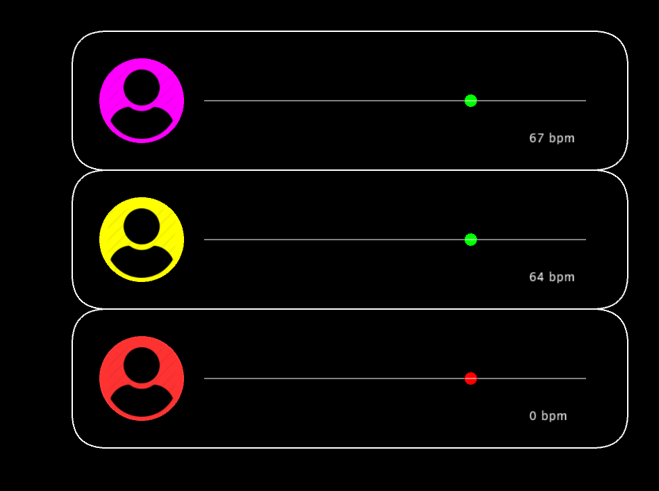
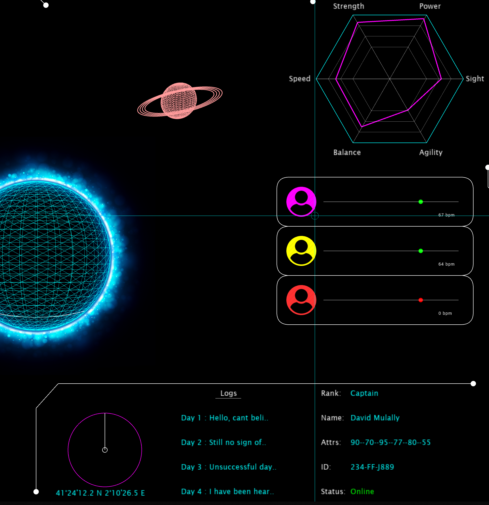
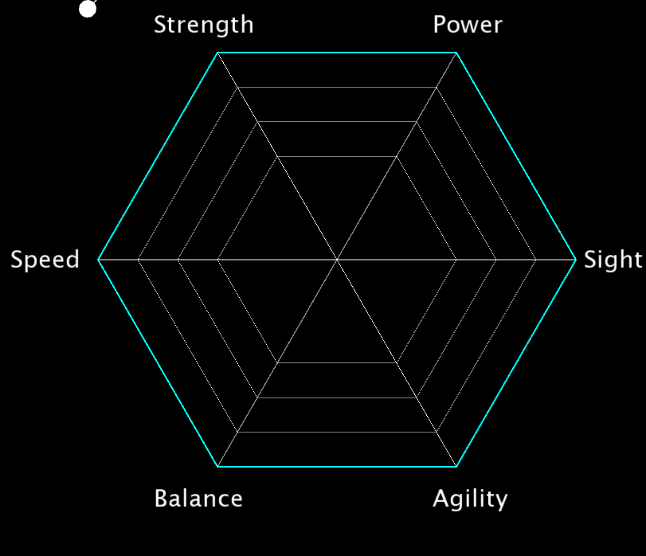

# SciFi UI Project

Name: Andrew McGowan

Student Number: C16470866

Youtube link: https://www.youtube.com/watch?v=-EgfXMudcyM

# Description of the assignment

My User Interface is a Sci-Fi control panel. My idea came from Prometheus, when they go down to a desolate planet and 3 people stay up in the ship monitoring them. 
Mine is slightely different as it is 3 people, on different parts of the planet. 

# Instructions
- Hover over most parts of UI and you will see things appear and dissappear
### 5 buttons on the top from left to right:
- Power button
- Communicate with one person
- Communicate with all 3
- Show location of people on planet
- Hide location on planet

### Three frames of people on the right
 - Press any of these and you will communicate with that person, when you hover over you will see their details

# How it works
settings(); -- Loading images, audio and Pvectors
loadTAble(); -- Loads table from csv file and prints them in console

draw(); -- Has the lines for navagation, ellipse when pressed, IF statements for which person to communicate to

hoverPlanets(); -- What happens when hovering over each planet
extraArc(); -- Arc rotating around the main planet and the loading icon in the top left
soldiers(); -- The details that come up when hovering over the soldiers as well as the display of their frames
buttons(); -- The buttons on the top of the UI
topRight(); -- The polygon and attribute table on the top right
drawGrid(); -- The grid that surrounds the UI
drawSphere(); -- Draws the rotating spheres and the rings around the ringed sphere
drawLeftMid(); -- This draws the lcation on the left along with the enemies in the radar
heartMonitor(); -- The 3 heart monitors on the right
drawDetails(); -- Rank, name, ID etc...

mousePressed(); -- Clicking certain areas changes a gobal variable for If statments, thus makaing a change on screen


# What I am most proud of in the assignment
What I am most proud about is the how I went about the project. Instead of trying to do it all in the space of 2 weeks I set myself a goal to make sure i work on it evry week and keep adding things to it. It gave me a chance to also think of new things and meant i was not worrying about getting it finished in time as I had the bulk of the assignment done with about a week or so to go. I am proud of many parts of the assignment but I feel my organisation and how I went about it really was my most proud aspect. My commits only date back a month ago when really I was working on it before hand and then we were sent a repo to fork and use for our projects.

# Markdown Tutorial

## CSV File
- The CSV file I used is Attributes.csv, whish contained the level of strengh etc. of the soldiers.
- The class Attributes.java is where get the details and get their values as local variables.
- In UI.java I load the table into an aray list called "attributes". I load and print the details in the same function ( void loadTable() ).

## Interactive ( Buttons )
- There are 8 buttons in my UI

- Person Icon = Communicate with one person
- People Icon = Communicate with all three people
- Location Icon = Show where they are on the planet 
- Settings Icon - Reset Buttons

- When you click one of these 3 frames you begin to communicate with that one person
```Java
 // IN DRAW
 if(COLOR_W == 1)
        {
            fill(255, 0, 255);
            stroke(255, 0, 255);
            ellipse(530, 1500, 120,120);
            image(person, 470, 1440, 120,120);
            noFill();
        }

public void mousePressed()
{
        if(mouseX > 900 && mouseX < 1000 && mouseY > 75 && mouseY < 135)
        {
            COLOR_W = 1;
        }
}
```
I used a global variable 'int COLOR_W' which was then used in an if statement to make the given changes. 

## Interactive ( Floating )

- When tou float over the frames on the right / midde you will get the attributes and details of each solider.

## PVectors
- Below is the code I used for the heart beat monitor. I have a global variable for this PVector.
- It is coded to change at certain X distances. When it hits that x distance its y will change.
```Java
 stroke(0, 255, 0);
 fill(0, 255, 0);
 ellipse(h1.x, h1.y, radius, radius);
        if(heart == 0)
        {
            h1.x += 6;
        }
        if(h1.x > 3300 && h1.x < 3340)
        {
            h1.y -= 9;
        }
        if(h1.x > 3340 && h1.x < 3420)
        {
            h1.y +=9;
        }
        if(h1.x > 3420 && h1.x < 3465)
        {
            h1.y -= 9;
        }
        if(h1.x > 3640)
        {
            h1.x = 3090;
        }
```
## Transforms
- Below is one of many examples of popMatrix and pushMatrix
- This was used for the main Planet for the location of the soldiers on the planet
- I used translate so that their location would rotate as if they were on the surface of the planet
```Java
float rotateX = 20 * radians(t += (TWO_PI / 360));
        pushMatrix();

            translate(width / 2, height / 2);
            rotateY(rotateX);
            noFill();
            stroke(0, 255, 255);
            strokeWeight(1f);
            sphere(r);

            // Soldier Locations on planet
            fill(255, 0, 0);
            stroke(255, 0, 0);
            translate(r - 80, r - 100);
            sphere(m);

            fill(255, 0, 255);
            stroke(255, 0, 255);
            translate(70 , -250);
            sphere(m);

            fill(255, 255, 0);
            stroke(255, 255, 0);
            translate(- 585, 70);
            sphere(m);

        popMatrix();
```
## Polymorphism
- Sun was created as child of Sphere
```Java
public class Sun extends Sphere
{

    Sun(float s, float r)
    {
        super(s, r);
    }

    void update()
    {
        //change in size
        sphereSize = 50;
        rotate = 20 * radians(t += (TWO_PI / 360));
        rotateY(rotate);
        sphere(sphereSize);
    }
}
```
## Interfaces
- I attempted to make an interface class but was unable.
- From what we had done I didnt have an object effecting another like AmmoPowerup etc.
```Java
package ie.tudublin;

interface Rotation
{
    public void applyTo(Sphere s);
}
```

## Polygon
- For the hexagon in the top right i used "Processing.org" to help me.

```Java
void polygon(int n, float cx, float cy, float r) 
    {
        float angle = 360.0f / n;

        beginShape();
        for (int i = 0; i < n; i++) 
        {
            vertex(cx + r * cos(radians(angle * i)),
            cy + r * sin(radians(angle * i)));
        }
        endShape(CLOSE);
    }

public void topRight()
{
    pushMatrix();
            
            translate(width - (width / 8), height / 6);

            noFill();
            stroke(0, 255, 255);
            strokeWeight(2);
            polygon(6, 0, 0, 300);

            stroke(255);
            strokeWeight(0.5f);
            polygon(6, 0, 0, 200);
            polygon(6, 0, 0, 250);
            polygon(6, 0, 0, 150);

        popMatrix();
 }
```
